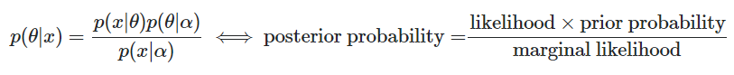

[Latent Dirichlet Allocation ](https://en.wikipedia.org/wiki/Latent_Dirichlet_allocation) (LDA) is a generative topic model which represents documents as mixture of topics assigning words with certain probabilities. The LDA model is considered as an unsupervised learning method which tries to find patterns in text documents by considering words in documents as observations.

LDA has two hyperparameters, where tuning them changes the induced topics. The questions are: What does the alpha and beta hyperparameters contribute to LDA? How does the topic change if one or the other hyperparameters increase or decrease? Why are they hyperparamters and not just parameters?

But for the answers, see [page in datascience.stackexchange](https://datascience.stackexchange.com/questions/199/what-does-the-alpha-and-beta-hyperparameters-contribute-to-in-latent-dirichlet-a) or the information below:

LDA uses a multivariate distribution, which can be the Dirichlet distribution. LDA assumes that:
 - A document can have multiple topics (because of this multiplicity, we need the Dirichlet distribution); and there is a Dirichlet distribution which models this relation.
 - Words can also belong to multiple topics, when you consider them outside of a document; so here we need another Dirichlet distribution to model this.
 
Theses two distributions which you do not observe from data are called latent, or hidden.

Now, in Bayesian inference you use the Bayes rule to infer the posterior probability. For simplicity, lets say you have data x and you have a model for this data governed by some parameters θ. In order to infer values for this parameters, in full Bayesian inference you will infer the posterior probability of these parameters using Bayes' rule with:

Note that here comes an α. This is your initial belief about this distribution, and is the parameter of the prior distribution. Usually this is chosen in such a way that will have a conjugate prior, so the distribution of the posterior is the same with the distribution of the prior.

The parameters of the prior are called hyperparameters. So, in LDA, both topic distributions, over documents and over words have also correspondent priors, which are denoted usually with alpha and beta, and because are the parameters of the prior distributions are called hyperparameters.

Additional, Assuming symmetric Dirichlet distributions (for simplicity), a low alpha value places more weight on having each document composed of only a few dominant topics (whereas a high value will return many more relatively dominant topics). Similarly, a low beta value places more weight on having each topic composed of only a few dominant words.

